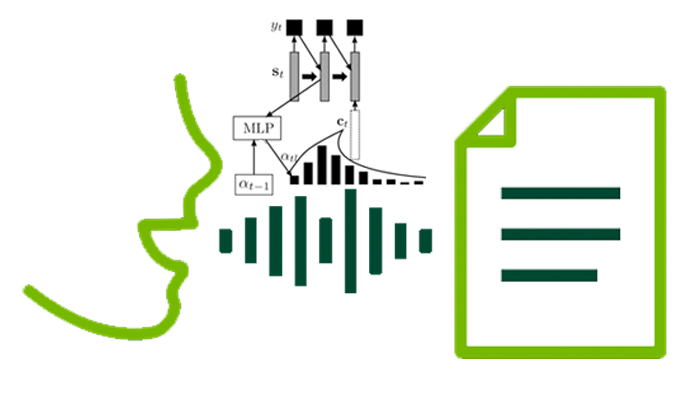

# SpeechRecognition
Speech recognition using attention-based neural networks on the Persian Farsdot and the English Librispeech datasets.
The implementation is mainly based on [this](https://arxiv.org/abs/1508.04395) paper and [this](https://towardsdatascience.com/customer-case-study-building-an-end-to-end-speech-recognition-model-in-pytorch-with-assemblyai-473030e47c7c) tutorial.
